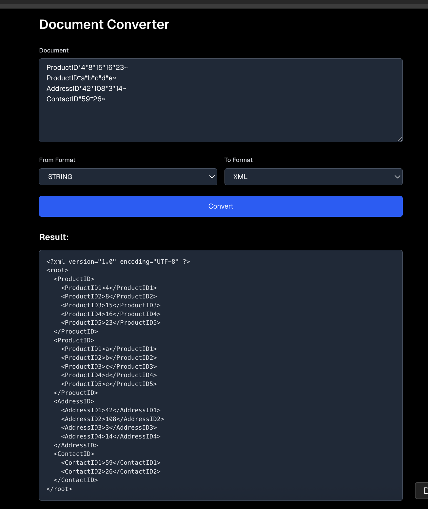
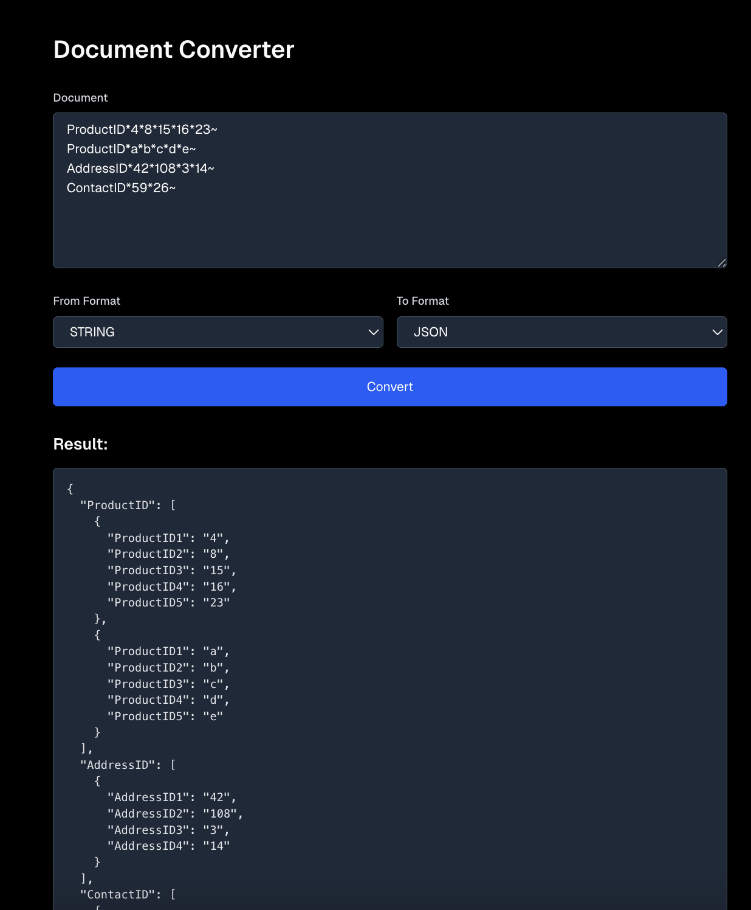
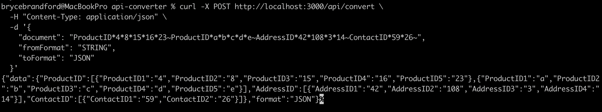

# Document Converter API

API to convert documents between three formats: **String**, **JSON**, and **XML**.





Areas I would improve if I had unlimited time. 
1. I like the idea of the provider structure I created but If we wanted to create multiple different converter providers each converter needs its own logic for the change. On the fence as it makes sense that we would want individual logic we could change individually but I think there is room for a central orchestrator to deal with the communication between providers better.
2. Obviously re-write the front end components as I quickly used cursor to create the front end for testing and display purposes and not production ready
3. Expand testing coverage to other providers
4. Work on a dependency registry or singleton injection instead of creating a new class in the route/providers.
5. Create a repository layer in the src/repository folder to store request/response and any metadata on the request for billing purpose's 


## Setup

```bash
npm install
npm run dev
```

## Testing

### Option 1: Web Interface

1. Run `npm run dev`
2. Open `http://localhost:3000` in your browser
3. Paste your document and select the formats to convert between

### Option 2: API Endpoint

Send a POST request to `/api/convert`:

```bash
curl -X POST http://localhost:3000/api/convert \
  -H "Content-Type: application/json" \
  -d '{
    "document": "ProductID*4*8*15*16*23~ProductID*a*b*c*d*e~AddressID*42*108*3*14~ContactID*59*26~",
    "fromFormat": "STRING",
    "toFormat": "JSON"
  }'
```

**Request:**
- `document`: The document to convert (string)
- `fromFormat`: Source format (`STRING`, `JSON`, or `XML`)
- `toFormat`: Target format (`STRING`, `JSON`, or `XML`)

## Example Documents

**String:**
```
ProductID*4*8*15*16*23~ProductID*a*b*c*d*e~AddressID*42*108*3*14~ContactID*59*26~
```

**JSON:**
```json
{
  "ProductID": [
    {"ProductID1": "4", "ProductID2": "8", "ProductID3": "15", "ProductID4": "16", "ProductID5": "23"},
    {"ProductID1": "a", "ProductID2": "b", "ProductID3": "c", "ProductID4": "d", "ProductID5": "e"}
  ],
  "AddressID": [{"AddressID1": "42", "AddressID2": "108", "AddressID3": "3", "AddressID4": "14"}],
  "ContactID": [{"ContactID1": "59", "ContactID2": "26"}]
}
```

**XML:**
```xml
<?xml version="1.0" encoding="UTF-8" ?>
<root>
  <ProductID>
    <ProductID1>4</ProductID1>
    <ProductID2>8</ProductID2>
    <ProductID3>15</ProductID3>
    <ProductID4>16</ProductID4>
    <ProductID5>23</ProductID5>
  </ProductID>
</root>
```

